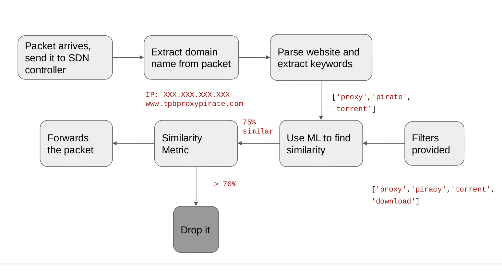
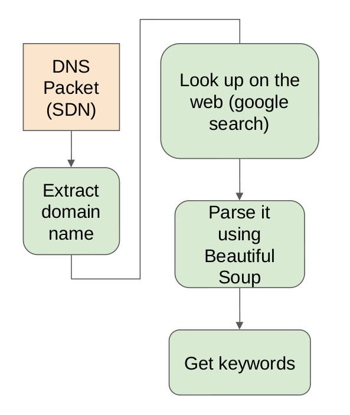
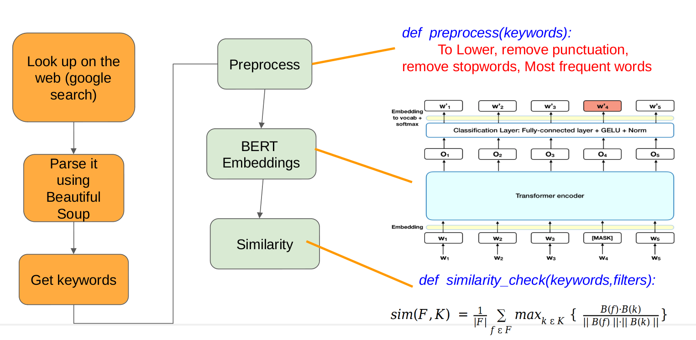

# Packet-Filtering-in-SDNs-with-ML
Given a filter, only traffic deemed legitimate by this filter will be allowed.

Avoid incoming traffic from websites hosting unwanted content with a domain name which cannot does not indicate the same

### Motivation
The current firewalls can easily be fooled, for example using content spoofing. Rules for dropping packets from website with a good domain name but hosting unwanted data, is rather difficult to set in traditional firewalls.

We aim to solve this problem using SDNs and ML.

### Workflow

### Setup
- Operating System = Ubuntu 18.04
- Programming Language = Python3
- APIs = beautifulsoup, bert embeddings, ryu, scapy
- Platform = Mininet / OpenFlow13.

### Instructions
  The variables which need to be modified for change in environment:
  - firewall_monitor.py:24:: sys.path.insert(1, '/home/harsha') # for importing checkSim.py.

  The variables which need to be modified for changing functionality:
  - checkSum.py:120:: filterword # filters used to block
  - firewall_monitor.py:28:: dns_servers # list of dns servers
  - firewall_monitor.py:30:: allow_subnet # subnets to allow
  - firewall_monitor.py:32:: reject_regex # subnets to reject

  For simulation of the network topology:

  `$ sudo mn --topo=tree,1,3 --mac --controller=remote --switch ovsk,protocols=OpenFlow13 --nat`

  To run the firewall_monitor.py from ryu:

  `$ ryu-manager --verbose firewall_monitor.py`

### About
This project is a partial fullfillment for CS3543 (Networks II) offered by Dr.Kotaro Kataoka at IIT Hyderabad in Spring'20 semester.
